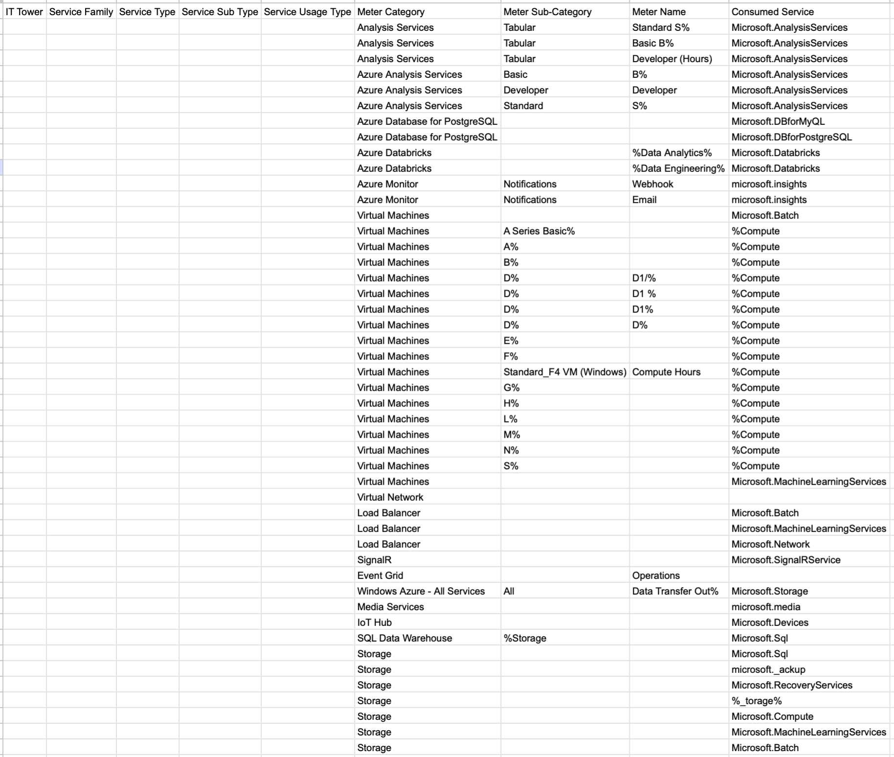
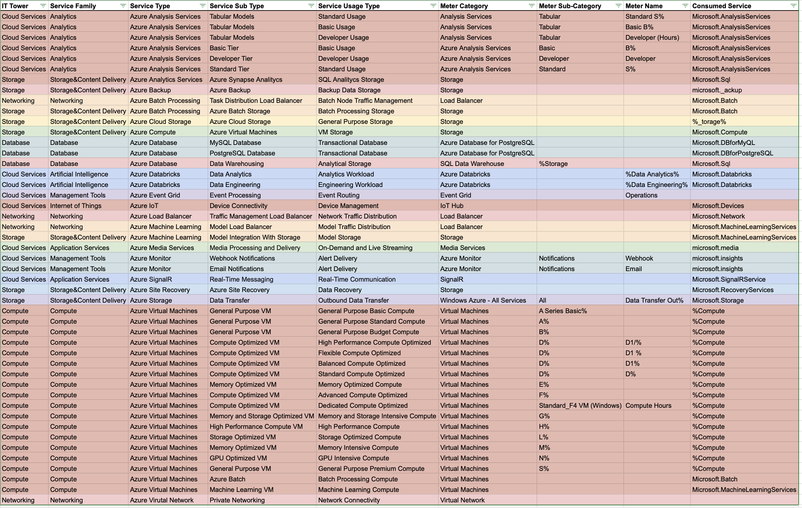

# Отчет по ЛР2 по облакам:

## Вариант 5

## Работу выполнили:

- Малахов Алексей
- Милютин Никита

## Цель работы:

1. Изучение спектра публичных облачных сервисов различных вендоров.
2. Разработка аналитических навыков для классификации облачных сервисов.
3. Формирование комплексного понимания облачных технологий без привязки к конкретному провайдеру.
4. Освоение подходов к созданию кросс-провайдерной модели сервисов.

## Задание:

1. Импортировать данные: Загрузить файл .csv в Excel или другую табличную программу и настроить данные для обработки.
2. Сопоставить и классифицировать: Соотнести данные с документацией провайдера, распределив потребление сервисов по
   иерархии от общей категории до конкретного использования.

## Выполнение работы:

До:

После:

Готовая Табличка: https://docs.google.com/spreadsheets/d/1N1e_Me5p30npMcSG9rh0kRb9vRKr8zRwAEo_fxddyLQ/edit?usp=sharing

### Описание сервисов:

1. Azure Analysis Services — управление моделями для бизнес анализа.
2. Azure Analytics Services — анализ биг даты в риалтайм.
3. Azure Backup — бэкапы данных в облаке.
4. Azure Batch Processing — выполнение больших параллельных задач.
5. Azure Cloud Storage — хранилище данных.
6. Azure Compute — железо для выполнения вычислений для приложений.
7. Azure Database — бд SQL и NoSQL.
8. Azure Databricks — аналитика с помощью ML.
9. Azure Event Grid — маршрутизация событий.
10. Azure IoT — управление устройствами IoT.
11. Azure Load Balancer — балансировка трафика.
12. Azure Machine Learning — инструменты для ML.
13. Azure Media Services — обработка и трансляция медиа.
14. Azure Monitor — мониторинг телеметрии.
15. Azure SignalR — добавление риалтайм функций в веб-приложения.
16. Azure Site Recovery — аварийное восстановление.
17. Azure Virtual Machines — ВМки для запуска приложений.
18. Azure Virtual Network — изолированные сети.

### Вывод:

В процессе выполнения аналитической работы мы ознакомились с сервисами Microsoft Azure и изучили их документацию, которая оказалась более понятной и удобной по сравнению с AWS. Мы классифицировали данные слепка биллинга от провайдера, вследствие чего успешно завершили работу.
