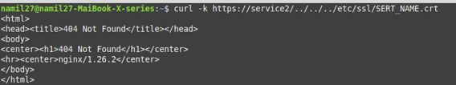
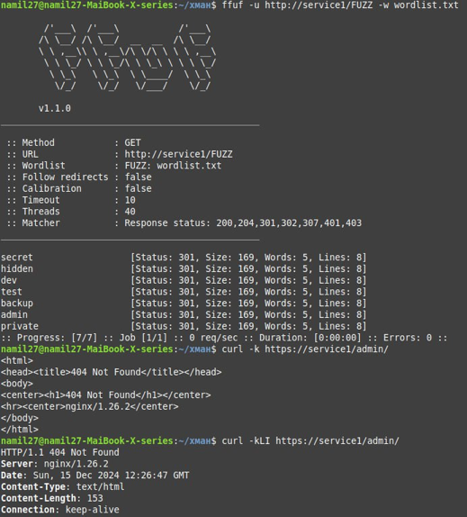
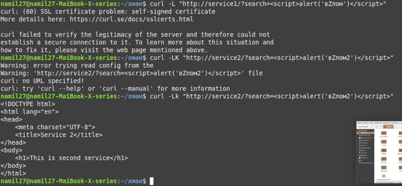

# Отчет по ЛР1 со звездочкой:

## Работу выполнили:

- Малахов Алексей
- Милютин Никита

## Задание:

Попробовать взломать nginx другой команды. Проверить минимум три уязвимости.

## Выполнение работы:

1. **Path Traversal** - попробовали выкрасть SERT_NAME.crt

   
   
   Не получилось - сервер вернул ошибку 404.

2. **Fuzz Faster U Fool**

   

   Из логов ffuf видно, что на вебсервере существуют папки из word-list, но с них редиректит. Однако нам все же удалось обнаружить важный раздел admin.

3. **Cross Site Scripting** - попробовали внедрить в сайт свой скрипт.

   

   Ничего не вышло из-за SSL сертификата.

## Итог:
Выполнив задание мы узнали о нескольких уязвимостях nginx и теперь будем их учитывать при реализации своих будущих проектов.
