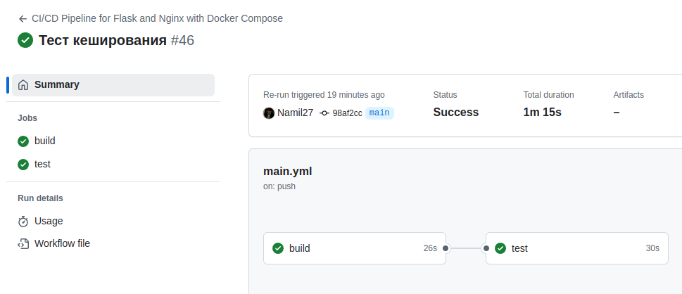
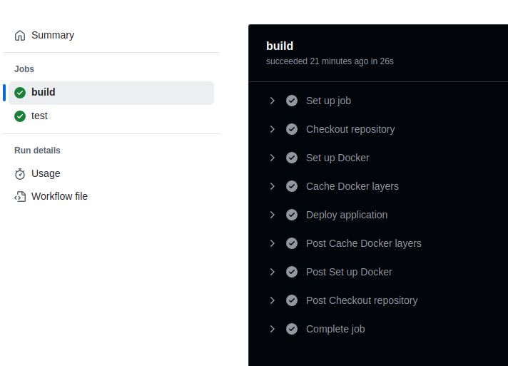
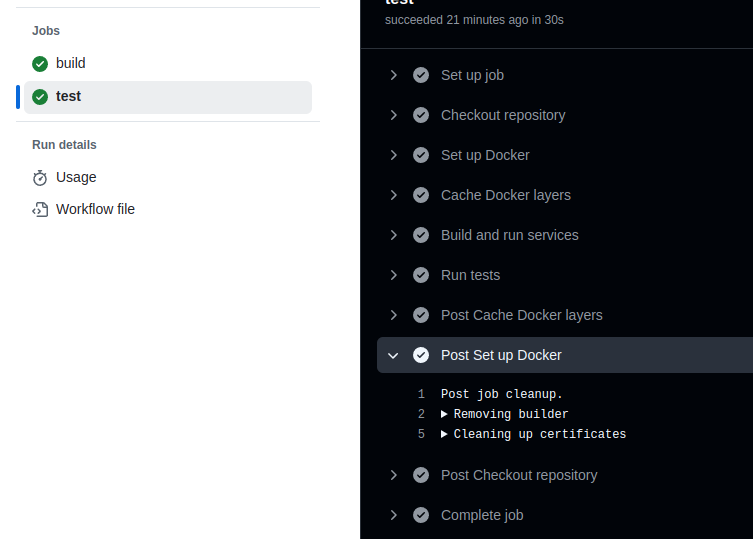

### Лабораторная работа 3: Настройка CI/CD

#### Введение

В этой лабораторной работе мы настраивали CI/CD для пет-проекта с веб-сервером и Flask-приложением. Сначала мы создали CI/CD файл с несколькими "плохими практиками", а затем исправили его, применив лучшие практики.

Файл CI/CD находится в .github/workflows и называется main.yml.

#### Шаг 1: Написание "плохого" CI/CD файла

Изначально CI/CD файл включал следующие "плохие практики":

1. Использование последней версии ОС (`runs-on: ubuntu-latest`)  
   _Почему это плохо:_ Последняя версия ОС может быть нестабильной.  
   _Исправление:_ Мы зафиксировали версию ОС на ubuntu-20.04 для стабильности.

2. Установка Docker Compose через `apt-get`  
   _Почему это плохо:_ Установка Docker Compose каждый раз замедляет процесс.  
   _Исправление:_ Заменили установку через apt-get на встроенный шаблон установки docker compose в github action.

3. Отсутствие кэширования Docker-слоев  
   _Почему это плохо:_ Полная пересборка контейнеров занимает много времени.  
   _Исправление:_ Мы добавили кэширование Docker-слоев с помощью actions/cache@v3, что ускорило процесс сборки.

4. Деплой с `docker-compose down` перед `docker-compose up`  
   _Почему это плохо:_ Остановка контейнеров может вызвать кратковременный простой сервисов.  
   _Исправление:_ Мы изменили команду на docker-compose up -d --build --no-deps, что позволяет перезапускать контейнеры без остановки.

5. Отсутствие кэширования зависимостей в тестах  
   _Почему это плохо:_ Установка зависимостей перед тестированием замедляет выполнение тестов.  
   _Исправление:_ Мы добавили кэширование зависимостей с помощью actions/cache@v3, что ускорило процесс тестирования.

#### Шаг 2: Написание "хорошего" CI/CD файла

После анализа и исправления проблем в "плохом" файле, мы переписали CI/CD файл с учётом лучших практик:

- Зафиксировали версию ОС на ubuntu-20.04 для стабильности.
- Заменили установку через apt-get на встроенный шаблон установки docker compose в github action.
- Внедрили кэширование Docker-слоев и зависимостей для ускорения сборки и тестирования.
- Изменили процесс деплоя на docker-compose up -d --build --no-deps для минимизации простоя.
- Добавили кэширование зависимостей в тестах для ускорения выполнения тестов.

### Запуск пайплайна

```yaml
name: CI/CD Pipeline for Flask and Nginx with Docker Compose

on:
  push:
    branches:
      - main  # Запускать pipeline при пуше в ветку main
  pull_request:
    branches:
      - main  # Запускать при создании PR в ветку main

jobs:
  build:
    runs-on: ubuntu-22.04

    steps:
      - name: Checkout repository
        uses: actions/checkout@v3

      # Установка Docker
      - name: Set up Docker
        uses: docker/setup-buildx-action@v2

      # Кэширование Docker образов
      - name: Cache Docker layers
        uses: actions/cache@v3
        with:
          path: /tmp/.buildx-cache
          key: ${{ runner.os }}-buildx-${{ github.run_id }}
          restore-keys: |
            ${{ runner.os }}-buildx-

      # Деплой приложения с помощью Docker Compose
      - name: Deploy application
        run: |
          cd ./lab3  # Переход в директорию с docker-compose.yml
          docker compose up -d --build  # Собрать и запустить контейнеры

  test:
    runs-on: ubuntu-22.04
    needs: build # Выполнить test только после успешного завершения build

    steps:
      # Checkout кода из репозитория
      - name: Checkout repository
        uses: actions/checkout@v3

      # Установка Docker
      - name: Set up Docker
        uses: docker/setup-buildx-action@v2

      # Кэширование Docker образов
      - name: Cache Docker layers
        uses: actions/cache@v3
        with:
          path: /tmp/.buildx-cache
          key: ${{ runner.os }}-buildx-${{ github.run_id }}
          restore-keys: |
            ${{ runner.os }}-buildx-

      # Сборка контейнеров с помощью Docker Compose
      - name: Build and run services
        run: |
          docker compose -f ./lab3/docker-compose.yml up -d --build  # Собрать и запустить контейнеры в фоне

      # Запуск тестов для Flask-приложения
      - name: Run tests
        run: |
          cd lab3  # Переход в директорию с docker-compose.yml
          docker compose exec -T flaskapp pytest  # Запуск тестов внутри контейнера

```





#### Заключение

Мы улучшили CI/CD пайплайн, сделав его более стабильным и эффективным, добавили кеширование, не используем дополнительную утилиту docker-compose. Исправления уменьшили время сборки и деплоя и снизили вероятность возникновения проблем, обеспечивая более быстрые и надежные результаты.
